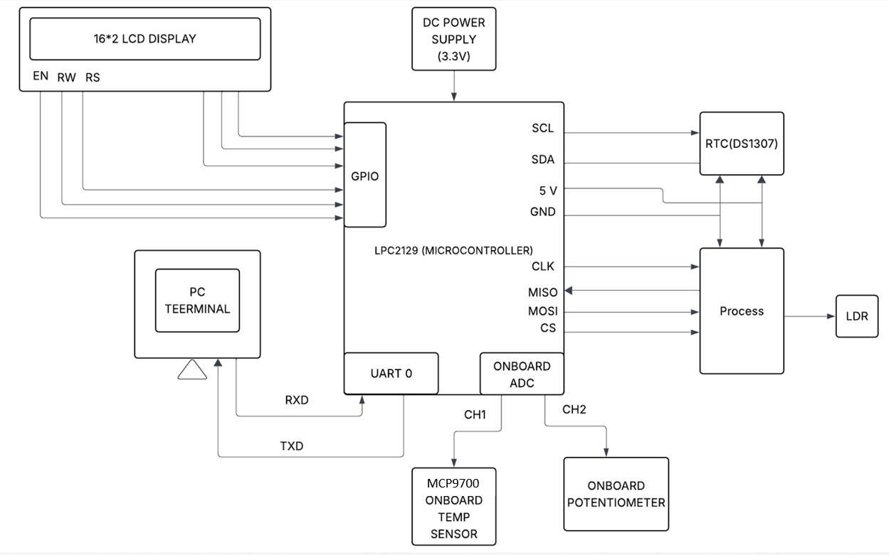
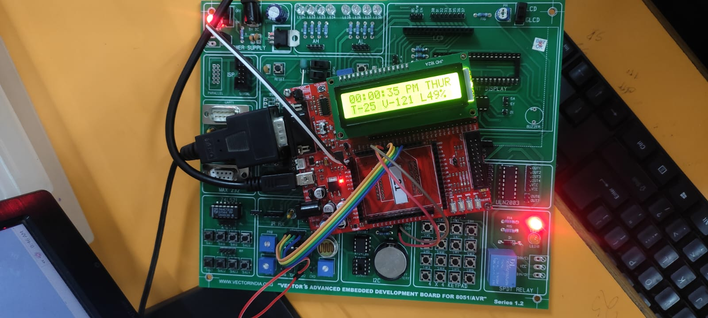
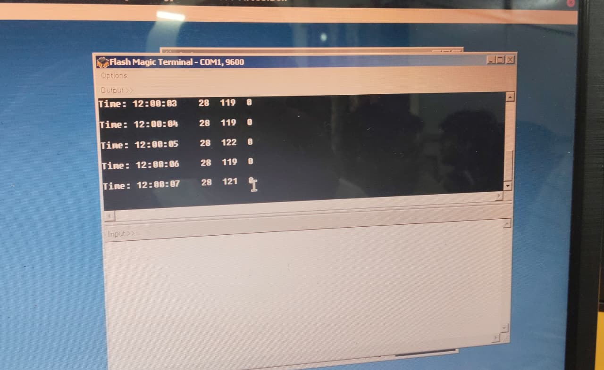

# Vehicle-Monitoring-DAS
Integrated Data Acquisition System for Vehicle Monitoring using LPC2129 (ARM7). Features: Temperature (MCP9700), Voltage, Light Monitoring, RTC timestamping, LCD display, and UART logging.
# 🚗 Integrated Data Acquisition System for Vehicle Monitoring

## 📌 Overview
This project implements an **Integrated Data Acquisition System (DAS)** using the **ARM7-based LPC2129 microcontroller**.  
It monitors:
- Temperature (MCP9700 sensor)
- Battery Voltage (Potentiometer input)
- Ambient Light Intensity (LDR via MCP3204 ADC)
- Real-Time Clock (DS1307) for timestamping

The acquired data is shown on an **LCD** and sent via **UART** to a PC.

## 🛠️ Repository Structure

- **code/** → All embedded C source files and drivers  
- **report/** → Final project report (PDF/DOCX)  
- **images/** → Block diagram, flowchart, output screenshots,Demo video of the project  
- **README.md** → Documentation  

## 💻 Hardware Components
- LPC2129 Microcontroller
- MCP9700 Temperature Sensor
- Potentiometer (Battery Simulation)
- LDR + MCP3204 ADC
- DS1307 RTC (I2C)
- 16×2 LCD
- Power Supply (3.3V)

---

## 📷 Project Screenshots

### Circuit Diagram

### LCD Output

### UART Terminal Log

---

## 📊 Results
- Real-time display of Temp, Voltage, and Light.  
- Timestamped logs sent to PC via UART.  
- Fast response (<1s update).  

---
## 🎥 Project Demo
[Download Demo Video](./images/demo.mp4)

## 🚀 Future Enhancements
- Add GSM/Wi-Fi module for remote monitoring.  
- Cloud-based IoT dashboard.  
- AI/ML for predictive vehicle maintenance.  
